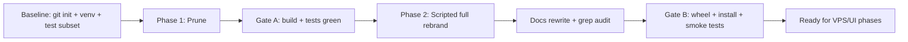

# Horizon: Rebrand and Prune

## Overview

Transform the Headroom codebase into "Horizon": first strip everything not needed for the target product (VPS-hosted Python proxy + future desktop UI), then perform a full scripted rebrand of every user-facing and internal identifier, with verification gates after each phase.

Target product: Horizon proxy deployed once on a company VPS (Python proxy — it has `HEADROOM_PROXY_TOKEN` auth; the Rust proxy has none), users connect via API key, desktop .exe UI comes later.

## Why the Rust workspace shrinks but does not vanish

`headroom/transforms/smart_crusher.py:3` states "The Python implementation has been retired (Stage 3c.1b)" and `headroom/transforms/text_crusher.py:20` imports `from headroom._core import TextCrusher`. The package builds via maturin ([pyproject.toml](pyproject.toml) `[tool.maturin]`, line 416). So `headroom-core` + `headroom-py` are **required** for compression; the `headroom-proxy`, `headroom-parity`, and `headroom-simulators` crates are **not** needed by the Python proxy and go away.

## Phase 0 — Safety net

- The folder is not a git repo: `git init`, `.gitignore` already exists, make a baseline commit of the untouched tree.
- Create a venv, `pip install -e .[proxy]` (maturin will build the Rust extension), and record a baseline run of a focused test subset: `pytest tests/test_transforms tests/test_ccr.py -x -q` plus `headroom --help` and a proxy import smoke. Every later gate compares against this.

## Phase 1 — Prune (Lean runtime)

Delete top-level:
- `plugins/` (agent-hooks, oauth2, hermes, openclaw, opencode), `sdk/`, `docs/` (Next.js site), `benchmarks/`, `e2e/`, `examples/`, `sbom/`, `REALIGNMENT/`, `deploy/` (beacon), `.github/` (no CI/publishing), `docker/` (e2e/capture helpers), `docker-bake.hcl`
- Keep `Dockerfile` + `docker-compose.yml` for VPS deploy (slim compose to the proxy service only); keep `scripts/install.ps1`/`install.sh` if referenced by Dockerfile paths, else prune
- Marketing assets (`*.gif`, `*.png`), `llms.txt`, `.changelog.md`, release config (`.release-please-*`, `.releasemetadata`), `RUST_DEV.md`, `claude_analysis_ttl.py` and other stray root scripts
- Keep: `LICENSE`, `NOTICE`, `.gitignore`, `.gitattributes`, `.dockerignore`, `Cargo.toml`, `rust-toolchain.toml`, `.cargo/`, `Makefile`, `pyproject.toml`

Rust workspace ([Cargo.toml](Cargo.toml)):
- Delete `crates/headroom-proxy/`, `crates/headroom-parity/`, `crates/headroom-simulators/`
- Edit `Cargo.toml` `members`/`default-members` (lines 3-20) down to `crates/headroom-core` + `crates/headroom-py`; drop now-unused workspace deps (axum, aws-*, gcp_auth if only the proxy used them)

Phone-home telemetry (keep local TOIN learning — CCR feedback depends on it):
- Remove `headroom/telemetry/beacon.py`, `headroom/telemetry/backends/`, `headroom/update_check.py`, and their CLI commands (`headroom/cli/telemetry.py`, `headroom/cli/update.py`), then grep-drive cleanup of every import/warmup reference (e.g. in `headroom/cli/main.py`, `headroom/proxy/warmup.py`)

Packaging/config cleanup:
- [pyproject.toml](pyproject.toml): remove extras/scripts referencing deleted components; keep `[proxy]`, `[code]`, `[ml]` extras
- [Makefile](Makefile): drop parity/benchmarks/docs targets; `.pre-commit-config.yaml`: drop plugin-sync hooks
- `tests/`: delete test trees for removed components (plugins, sdk, beacon, update, e2e, parity); grep for `from headroom.telemetry.beacon`, `update_check`, etc. to catch strays

**Gate A:** editable install succeeds; baseline test subset green; `headroom --help` and `headroom proxy --help` work; `cargo check -p headroom-core -p headroom-py` clean. Commit.

## Phase 2 — Full rebrand (scripted)

Write one idempotent rename script (Python) that applies ordered, case-aware replacements over all text files, with an exclusion list. Categories:

1. **Package/import paths**: rename `headroom/` -> `horizon/`; rewrite `import headroom`, `from headroom...`, `headroom.` across `horizon/` and `tests/`
2. **Env vars**: `HEADROOM_` -> `HORIZON_` (e.g. `HORIZON_PROXY_TOKEN`, `HORIZON_MODE`, `HORIZON_TLS_STRICT`) in code, Dockerfile, compose, scripts
3. **Config/state paths**: `~/.headroom` / `.headroom` dir strings -> `~/.horizon` / `.horizon` (note: no data migration; old dirs are simply orphaned — fresh start)
4. **CLI**: `[project.scripts]` (pyproject.toml:354-356) -> `horizon = "horizon.cli:main"`, `horizon-cache-ttl = ...`; every usage/help string in `horizon/cli/wrap.py` and friends
5. **Packaging**: project name `headroom-ai` -> `horizon-ai` (from-source install; no PyPI dependency), `[tool.maturin]` package-dir references, extras self-references (`headroom-ai[proxy]` -> `horizon-ai[proxy]`)
6. **Rust**: crate names -> `horizon-core`/`horizon-py` (Cargo.toml files, path deps), pyo3 module `headroom._core` -> `horizon._core` (`#[pymodule]` name in `crates/headroom-py/src/lib.rs`, maturin `module-name`), workspace `repository`/`authors` strings
7. **Wire-level names (all-at-once for internal consistency)**: `x-headroom-` headers -> `x-horizon-`; tool name `headroom_retrieve` -> `horizon_retrieve`; `headroom_compress` MCP tool and the `"headroom"` MCP server name -> horizon equivalents; CCR marker/summary strings; `HORIZON_PROXY_TOKEN` gate strings in `horizon/proxy/server.py`
8. **User-facing strings**: dashboard templates/static, banners, log text, docs links (`headroomlabs.ai` URLs -> placeholder or removal — the upstream org is not yours)

Exclusions (never touched): `CHANGELOG.md` history (replaced anyway in step 9), `LICENSE`/`NOTICE`, third-party proper nouns (`Copilot-Integration-Id` is GitHub's header), `tiktoken`/provider names, binary/asset files.

## Phase 3 — Docs and residue

- Replace README.md with a short Horizon README: what it is, VPS deploy via Docker, `HORIZON_PROXY_TOKEN`, `horizon wrap claude --no-proxy` usage; delete stale docs elsewhere
- Start a fresh CHANGELOG.md stub
- Grep audit: case-insensitive `headroom` across the tree; target near-zero outside intentional keeps; fix strays
- Rename the local helpers to `connect-horizon-vps.ps1` / `disconnect-horizon-vps.ps1` and update their strings/state-file path

**Gate B:** `maturin build` wheel succeeds; fresh venv install of the wheel; `horizon --help`, `horizon wrap claude --help`, `horizon proxy` boot smoke; `pytest tests/test_transforms tests/test_ccr.py tests/test_cli -x -q` green; `cargo check` for both kept crates; final grep audit clean. Commit.

## Explicitly out of scope (follow-up phases)

- Multi-user API-key auth on the proxy (today: single shared `HORIZON_PROXY_TOKEN`)
- The desktop .exe UI (connect via key, wrap buttons)
- VPS deployment automation / hardened compose with TLS

## Key files touched

- [pyproject.toml](pyproject.toml) — name, scripts, maturin, extras
- [Cargo.toml](Cargo.toml) — workspace members, metadata
- [headroom/cli/wrap.py](headroom/cli/wrap.py), [headroom/cli/main.py](headroom/cli/main.py) — CLI surface
- [headroom/proxy/server.py](headroom/proxy/server.py) — token gate, headers, endpoints
- [headroom/ccr/tool_injection.py](headroom/ccr/tool_injection.py), [headroom/proxy/models.py](headroom/proxy/models.py) — wire tool names
- [crates/headroom-py/src/lib.rs](crates/headroom-py/src/lib.rs) — pyo3 module name
- [docker-compose.yml](docker-compose.yml), [Dockerfile](Dockerfile) — deploy surface

## Implementation Checklist
1. [PENDING] git init, baseline commit, venv, editable install, record baseline test results <!-- id:a0-baseline -->
2. [PENDING] Delete agreed top-level dirs, release config, marketing assets; slim compose <!-- id:a1-prune-top -->
3. [PENDING] Remove headroom-proxy/parity/simulators crates; fix Cargo.toml members + deps <!-- id:a1-prune-rust -->
4. [PENDING] Remove beacon/update-check paths and CLI commands; keep TOIN learning <!-- id:a1-prune-telemetry -->
5. [PENDING] Clean pyproject extras, Makefile, pre-commit; delete orphaned tests <!-- id:a1-prune-config-tests -->
6. [PENDING] Gate A: install + baseline subset green + cargo check; commit <!-- id:a-gate-a -->
7. [PENDING] Write and apply scripted full rebrand (dirs, imports, env vars, paths, CLI, packaging, Rust, pyo3 module) <!-- id:a2-rebrand -->
8. [PENDING] Wire-level renames in same pass: headers, tool name, MCP names, markers <!-- id:a2-wire -->
9. [PENDING] New README, CHANGELOG stub, grep audit, rename VPS helper scripts <!-- id:a2-docs -->
10. [PENDING] Gate B: wheel build, fresh install, CLI/proxy smoke, pytest subset, cargo check, grep audit; commit <!-- id:a-gate-b -->
11. [PENDING] horizon/keys SQLite store + horizon keys issue/list/revoke CLI <!-- id:b1-keys -->
12. [PENDING] Auth middleware: accept per-user keys, keep master token, 401 handling <!-- id:b2-auth -->
13. [PENDING] Strip inbound Horizon credential on forward; inject operator upstream creds <!-- id:b3-upstream -->
14. [PENDING] Tag request scope/metrics/logs with key name for per-user savings <!-- id:b4-attribution -->
15. [PENDING] deploy/vps pack: compose + Caddy TLS + .env.example + runbook <!-- id:b5-deploy -->
16. [PENDING] Gate B2: keys/auth/upstream tests, authed round-trip, compose validation; commit <!-- id:b-gate -->
17. [PENDING] Scaffold desktop/: Tauri v2 + Vite React TS <!-- id:c1-scaffold -->
18. [PENDING] Local loopback forwarder in src-tauri with key injection + Rust unit tests <!-- id:c2-forwarder -->
19. [PENDING] API key via OS credential store; settings via tauri-plugin-store <!-- id:c3-storage -->
20. [PENDING] PyInstaller horizon-cli.exe sidecar; Wrap/Unwrap buttons drive wrap claude --no-proxy <!-- id:c4-sidecar -->
21. [PENDING] Connect/Status/Actions/Diagnostics screens wired to forwarder + /stats <!-- id:c5-ui -->
22. [PENDING] Gate C: tauri build .exe + installer, smoke checklist, commit <!-- id:c-gate -->

